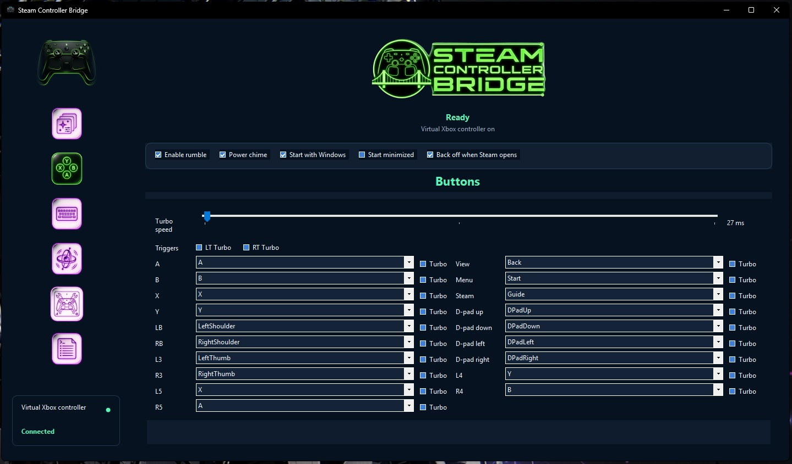

# Steam Controller Bridge

Steam Controller Bridge is a tiny Windows tray app that makes the 2026 Steam Controller appear as a virtual Xbox 360 controller.

The goal is to replicate the most useful parts of Steam Input without needing Steam running: connect the controller, turn the bridge on, and launch a game. No Steam shortcut setup, no giant dashboard.



## Current Status

This is an early public test build. It works by reading the Steam Controller's raw HID reports and forwarding gamepad input to a virtual Xbox 360 controller through ViGEmBus.

The app is useful today, but it is still community test software. Expect some rough edges around rumble tuning, Steam handoff, and firmware differences.

## Install

1. Download the latest release from the GitHub Releases page.
2. Install ViGEmBus if you do not already have it.
3. Run `SteamControllerBridgeSetup-0.10.0.exe`, or extract the portable ZIP.
4. Close Steam before turning the bridge on.
5. Connect the Steam Controller by USB or the Steam Controller Puck.
6. Open Steam Controller Bridge and click the controller icon in the upper-left corner.

The installer does not install ViGEmBus automatically. If ViGEmBus is missing, the app will show a clear status message when you turn the bridge on.

## First Run

- Keep Steam closed while testing the bridge.
- Use the controller icon in the upper-left corner to turn the bridge on or off.
- Use the sidebar pages when you want presets, saveable profiles, button remaps, keyboard mappings, turbo, trackpad mouse, gyro, logs, startup, or Steam handoff settings.
- For Nintendo-style layouts, set physical `A` to output `B` and physical `B` to output `A`.
- If a game sees double input, close Steam and any other controller remapping tools.

## Features

- One-switch tray app
- Direct HID input from the 2026 Steam Controller / Steam Controller Puck, including Valve `0x1302`, `0x1303`, and `0x1304` HID product IDs
- Virtual Xbox 360 output for XInput games
- Best-effort Xbox rumble passthrough to Steam Controller haptics
- Rumble enable/disable toggle
- Full button remapping, including ABXY, bumpers, D-pad, stick clicks, View/Menu, Steam/Guide, and L4/L5/R4/R5
- Per-button turbo toggles
- One-click remap presets, including Nintendo swap, FPS gyro options, and Old School FPS
- Saveable profiles with import/export support for sharing layouts
- Centered logo header with icon-only sidebar navigation
- Optional trackpad-as-mouse mode
- Optional trackpad-as-stick mode with left/right stick output, sensitivity, deadzone, and vertical invert controls
- Optional gyro output to mouse or the virtual right stick
- Experimental DSU/Cemuhook motion server for emulator-native gyro/accelerometer output
- Optional left-stick WASD and right-stick mouse mode for older keyboard-and-mouse-only games
- Optional haptic power chime when the bridge turns on or off
- Rumble intensity slider with test rumble and test chime controls
- Local MIDI haptic chime player for user-provided MIDI files
- Right-stick mouse speed and vertical invert controls
- Keyboard key mapping for controller buttons, triggers, pad clicks, and back paddles
- Universal turbo speed control and trigger turbo toggles
- Saveable profiles with startup loading, duplicate, import, export, delete, and unsaved-change status
- Start with Windows toggle
- Start minimized to system tray toggle
- Automatic Steam handoff and reconnect attempts
- Deep HID diagnostics for troubleshooting controller detection
- Lizard mode disable while enabled
- Lizard mode restore on normal shutdown
- Custom app/tray icon
- Input Test page for live front/back controller state checks
- Small diagnostic probe project for controller/interface debugging

## Requirements

- Windows 10 or newer
- No separate .NET install is required when using the self-contained release build
- ViGEmBus installed
- 2026 Steam Controller, wired or through the Steam Controller Puck

Steam should be closed for this MVP. Steam can claim the controller and interfere with direct HID access.

ViGEmBus is retired/end-of-life, so it is treated as a practical MVP backend rather than the ideal long-term foundation.

## Build

```powershell
dotnet build .\SteamControllerBridge.sln -c Release
```

## Run From Source

```powershell
dotnet run --project .\SteamControllerBridge\SteamControllerBridge.csproj
```

## Publish

```powershell
dotnet publish .\SteamControllerBridge\SteamControllerBridge.csproj -c Release -r win-x64 --self-contained true -o .\dist\SteamControllerBridge-win-x64-self-contained
```

Zip the contents of `dist\SteamControllerBridge-win-x64-self-contained` for a GitHub Release, or build the Inno Setup installer from `installer\SteamControllerBridge.iss`.

## Diagnostic Probe

The probe lists Valve HID interfaces and reports whether they emit controller reports:

```powershell
dotnet run --project .\SteamControllerBridge.Probe\SteamControllerBridge.Probe.csproj
```

This is useful when Windows sees the controller but the bridge cannot find the live input interface.

## Limitations

- DSU/Cemuhook motion output is experimental and may need axis/deadzone tuning per emulator or game
- No HidHide integration yet
- Virtual output currently depends on ViGEmBus
- Steam Controller haptics are implemented as best-effort rumble and may need tuning on real hardware
- Advanced remapping is global, not per-game
- Gyro can map to mouse, virtual right-stick movement, or experimental DSU motion output

## Credits

This project is informed by public community work around Steam Controller HID reports and virtual gamepad output. It does not include code from SISR or SteamlessController.
