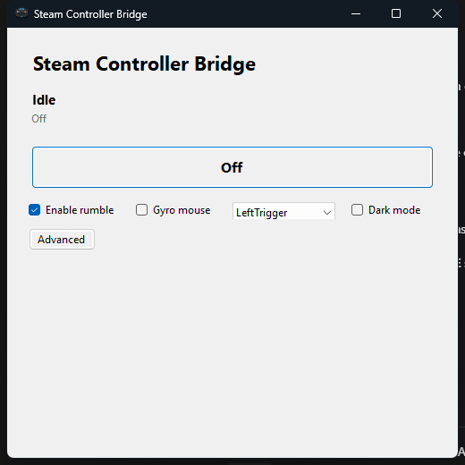

# Steam Controller Bridge

A tiny Windows tray app that makes the 2026 Steam Controller appear as a virtual Xbox 360 controller.

The intended experience is deliberately simple:

1. Connect the Steam Controller.
2. Open Steam Controller Bridge.
3. Turn it on.
4. Launch a Game Pass, Epic, emulator, or other XInput game.



## Install

1. Download the latest release.
2. Install ViGEmBus if it is not already installed.
3. Run the installer or extract the portable ZIP.
4. Close Steam before turning the bridge on.
5. Connect the Steam Controller by USB or the Steam Controller Puck.
6. Click `On`.

The installer does not install ViGEmBus automatically. If ViGEmBus is missing, the app reports that in the main window.

## Current MVP

- Finds the wired controller or Steam Controller Puck HID interface.
- Disables lizard mode while enabled.
- Creates one virtual Xbox 360 controller through ViGEmBus.
- Translates and remaps standard gamepad inputs into XInput:
  - ABXY
  - D-pad
  - bumpers
  - back paddles
  - triggers
  - sticks
  - stick clicks
  - View/Menu
  - Steam button as Guide
- Passes Xbox rumble through to Steam Controller haptics on a best-effort basis.
- Provides optional trackpad mouse mode.
- Saves simple advanced options, including full button remapping, turbo toggles, startup, Steam handoff, and dark mode.
- Can back off when Steam starts and reconnect when Steam closes.
- Restores lizard mode when turned off or when the app exits normally.
- Keeps advanced options and the log hidden behind one button.

## Requirements

- Windows 10 or newer.
- .NET 9 desktop runtime if running the framework-dependent build.
- ViGEmBus installed.

ViGEmBus is retired, so it is treated as an MVP backend rather than the ideal long-term foundation. The bridge code keeps virtual-controller output isolated so another backend can replace it later.

## Build

```powershell
dotnet build
```

## Run

```powershell
dotnet run
```

## Notes

Steam should be closed for this MVP. Steam can claim the controller, which prevents direct raw HID access.

Trackpad-as-stick, HidHide duplicate suppression, native motion output, and a better virtual-device backend are intentionally left out of this pass so the core switch stays reliable.

Steam Controller haptics are implemented from public output-report behavior and may need tuning on real hardware.
